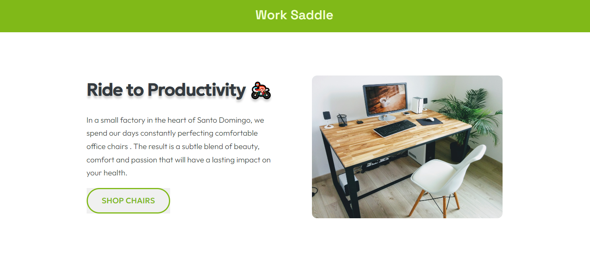

# Work Saddle 💺

This is a project to exercice my skillz. 

## Table of contents

- [The projets](#the-project)
- [Built with](#built-with)
- [Links](#links)
- [What I learned](#what-i-learned)
- [Useful resources](#useful-resources)
- [Author](#author)

## 💡 The project

The project is to build out a landing page with a pretty interface so I can exercice my frontend skillz.

## 🛠️ Built with

## 🔗 Links

- Live Site : [Work Saddle](https://work-saddle.netlify.app/)

## 🧠 What I learned

* Tried to do **clean code**
* Used HTML5 **semantic elements** for **accessibility**
* Used **Git** and **GitHub** for project management.

## Useful resources

- [MDN](https://developer.mozilla.org/en-US/)

## 😎 Author

- Website - [Karibbean Creative](https://karibbeancreative.xyz/)
- GitHub - [@karibbeanCreative](https://github.com/karibbeanCreative)
- Instagram - [Karibbean Creative](https://www.instagram.com/karibbean.creative/)

Don't hesitate to tell me what you think and connect if you want.

See u soon ✌🏽